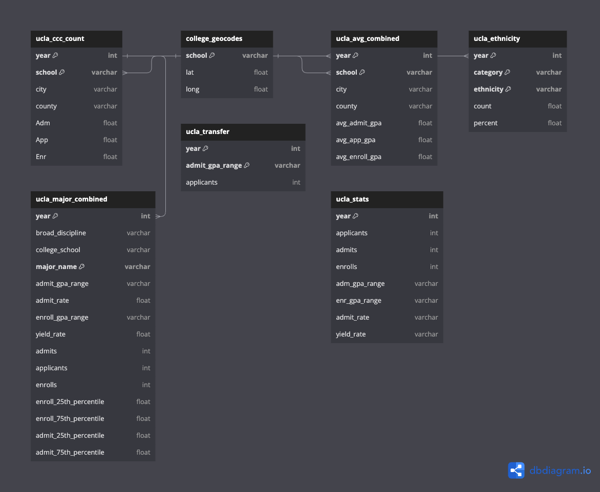

# UCLA Transfer Tableau Dashboard 

**Author**: Kat L., University of California, Los Angeles (UCLA)

> **Tools**: Tableau, PostgreSQL, Figma, dbdiagram.io


[Link to Tableau UCLA Dashboard](https://public.tableau.com/app/profile/katrina.ione.limqueco1904/viz/UCLADashboard_16960345168190/UCLATransferDashboard?publish=yes)


## Description 
This project consists of an interactive Tableau dashboard providing a detailed analysis of the University of California transfer data from 2018 to 2022. The dashboard uncovers significant demographic and statistical trends among transfer students, revealing insights into preferred majors, originating community colleges, and more.

## Data 
The data used for this dashboard is sourced from the [University of California](https://www.universityofcalifornia.edu/), encompassing various aspects like ethnicity, majors, GPA, and geographical information related to transfer students. The datasets are stored in `.csv` format

## Database Schema


## Repository Structure  
```bash 
├── dashboard              # contains the Tableau Workbook file for the dashboard
│   └── UCLA Dashboard.twb 
├── data                   
│   ├── 18_ucla_ccc_count.csv   # data specific to the year 2018
│   ├── 19_ucla_ccc_count.csv   # data specific to the year 2019
│   ├── 20_ucla_ccc_count.csv   # data specific to the year 2020
│   ├── 21_ucla_ccc_count.csv   # data specific to the year 2021
│   ├── 22_ucla_ccc_count.csv   # data specific to the year 2022
│   ├── college_geocodes.csv    # contains geographical coordinates of colleges
│   ├── ucla_avg_combined.csv   # combined data including average GPAs
│   ├── ucla_ccc_count.csv      # consolidated count data
│   ├── ucla_ethnicity.csv      # data regarding ethnicity of students
│   ├── ucla_major_combined.csv # combined data related to majors
│   ├── ucla_stats.csv          # statistical data related to UCLA
│   └── ucla_transfer.csv       # overall transfer data
├── img                    # images
└── sql-scripts            # contains SQL scripts used for creating tables and performing data analysis
    ├── 01-create-tables.sql    # SQL script for creating necessary tables in the database
    └── 02-data-analysis.sql    # SQL script containing queries used for performing comprehensive data analysis
```
